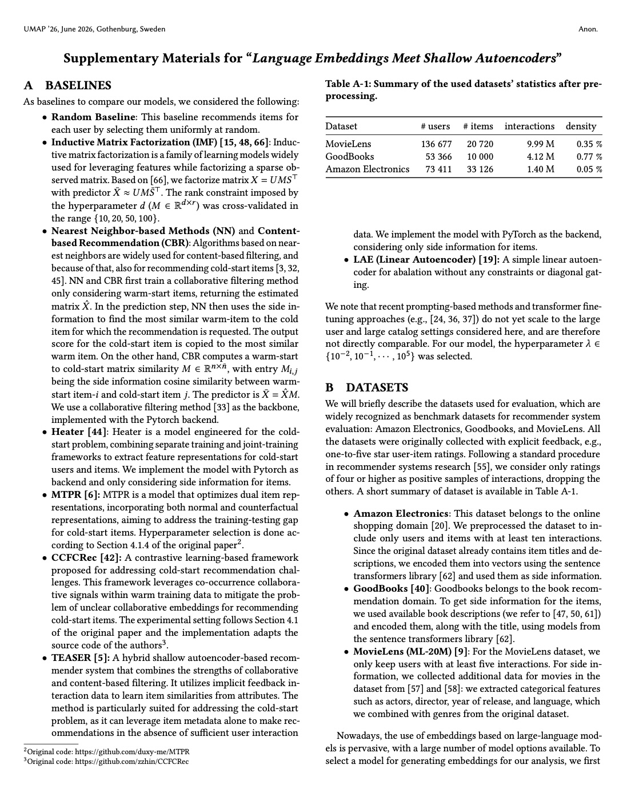

# Language Embeddings Meet Shallow Autoencoders

Official repository for the paper "Language Embeddings Meet Shallow Autoencoders", currently under review at **THE ACM UMAP 2026 Conference** - *Short Paper Track*.

## Overview

Shallow autoencoders are appealing recommenders due to their simplicity, scalability, and competitive retrieval quality, but they struggle in strict cold-start settings where new items have no interactions. We propose an inductive shallow autoencoder that leverages item side information (language embeddings) by fixing the decoder to item features and learning only an encoder in the same semantic space. To prevent trivial self-reconstruction without enforcing a hard zero diagonal, we introduce diagonal gating: a leave-one-item-out objective that blocks the self-copy shortcut only for the item being updated while retaining context from the rest of the user history. An efficient ALS-style optimization trains the model. Experiments on three real-world benchmarks show consistent gains over strong cold-start baselines, including other shallow autoencoders, and support lightweight (cross-domain) semantic user modeling.

## Appendix

## [Live Demo](https://anon-shallowembeds.streamlit.app/)

The source code for the demo lives in the [demo branch](https://github.com/anonymized-gh-repo/shallowembeds/tree/demo).

